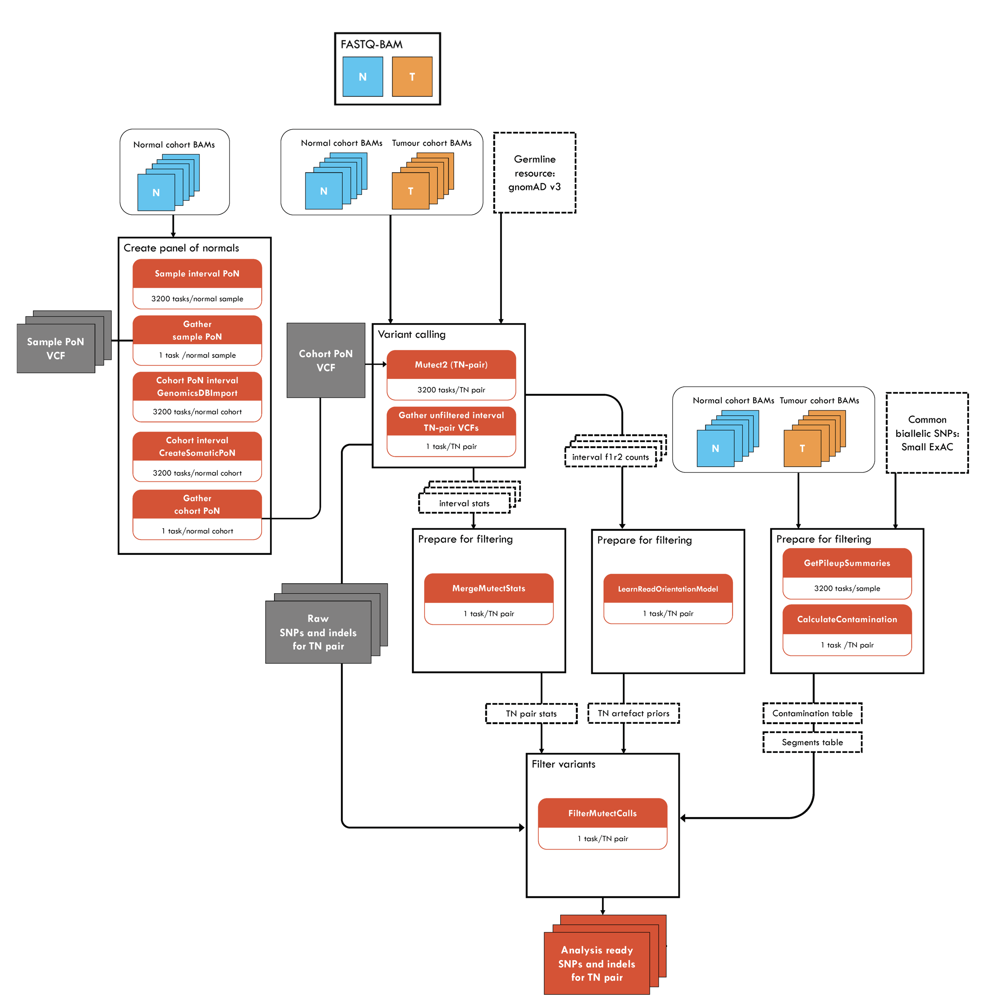

# Somatic-shortV-nf

<p align="center">
:wrench: This pipeline is currently under development and is not currently functional :wrench:
</p> 

  - [Description](#description)
  - [Diagram](#diagram)
  - [User guide](#user-guide)
      - [Infrastructure usage and
        recommendations](#infrastructure-usage-and-recommendations)
  - [Benchmarking](#benchmarking)
  - [Workflow summaries](#workflow-summaries)
      - [Metadata](#metadata)
      - [Component tools](#component-tools)
  - [Additional notes](#additional-notes)
  - [Help/FAQ/Troubleshooting](#helpfaqtroubleshooting)
  - [Acknowledgements/citations/credits](#acknowledgementscitationscredits)

## Description
Somatic-shortV-nf is a pipeline for identifying somatic short variant (SNPs and indels) events in human Illumina short read whole genome sequence data from tumour and matched normal BAM files. The pipeline follows the [GATK's Best Practices](https://gatk.broadinstitute.org/hc/en-us/articles/360035894731-Somatic-short-variant-discovery-SNVs-Indels-) workflow. The pipeline is written in Nextflow and uses Singularity to run containerised tools.

There are two main steps to this workflow: 
1. Generate a large set of candidate somatic variants using GATK's [Mutect2](https://gatk.broadinstitute.org/hc/en-us/articles/360035531132). 
2. Filter the candidate variants to obtain a more confident set of somatic variant calls. 

## Diagram

<p align="center"> 

</p> 

## User guide 

To run this pipeline, you will need to prepare your input files, reference data, and clone this repository. Before proceeding, ensure Nextflow is installed on the system you're working on. To install Nextflow, see these [instructions](https://www.nextflow.io/docs/latest/getstarted.html#installation). 

### 1. Prepare inputs

To run this pipeline you will need the following inputs: 

* Paired Tumor-Normal (T-N) BAM files
* Corresponding BAM index files  
* Input sample sheet 

This pipeline processes paired BAM files and is capable of processing multiple samples in parallel. BAM files are expected to be coordinate sorted and indexed (see [Fastq-to-BAM](https://github.com/Sydney-Informatics-Hub/Fastq-to-BAM) for an example of a best practice workflow that can generate these files).  

You will need to create a sample sheet with information about the samples you are processing, before running the pipeline. This file must be **comma-separated** and contain a header and one row per sample. Columns should correspond to sampleID, BAM-N file-path, BAM-T file-path: 

```csv
sampleID,bam-N,bam-T 
SAMPLE1,/data/Bams/sample1-N.bam,/data/Bams/sample1-T.bam
SAMPLE2,/data/Bams/sample2-N.bam,/data/Bams/sample2-T.bam
``````

When you run the pipeline, you will use the mandatory `--input` parameter to specify the location and name of the input sample sheet file: 

```
--input /path/to/samples.csv
```

### 2. Prepare the reference materials 

To run this pipeline you will need the following reference files:

- Indexed reference genome in FASTA format. 
- Genomic-interval list files for Mutect2
- Panel of Normals (PoN) file for Mutect2
- Common biallelic variant resources for GetPileupSummaries 

You can download FASTA files from the [Ensembl](https://asia.ensembl.org/info/data/ftp/index.html), [UCSC](https://genome.ucsc.edu/goldenPath/help/ftp.html), or [NCBI](https://www.ncbi.nlm.nih.gov/genome/doc/ftpfaq/) ftp. sites. Reference FASTA files must be accompanied by specific index files. You can use our [IndexReferenceFasta-nf pipeline](https://github.com/Sydney-Informatics-Hub/IndexReferenceFasta-nf) to generate indexes. 
This pipeline uses the following tools for generating specific index files.
  - [samtools](https://www.htslib.org/doc/samtools-faidx.html).fai
  - [picard](https://gatk.broadinstitute.org/hc/en-us/articles/360037593331-CreateSequenceDictionary-Picard-).dict 
  - [bwa](https://bio-bwa.sourceforge.net/bwa.shtml).amb, .ann, .bwt, .pac, .sa 

When you run the pipeline, you will use the mandatory --ref parameter to specify the location and name of the reference.fasta file:
```
--ref /path/to/ref.fasta
```

**Create genomic-interval list files using the pipeline**  
Interval lists define subsets of genomic regions in the genome. It is advisable to split the genome into genomic-intervals to parallelize execution and/or exclude regions that have bad or uninformative data. Please refer to this [link](https://gatk.broadinstitute.org/hc/en-us/articles/360035531852-Intervals-and-interval-lists) for more details. 

Documented below are the two different methods by which you can generate the interval files for Mutect2 when you run the pipeline using the nextflow command.  

***Generate optimised number of intervals based on your genome size***  
When you run the pipeline, you will use the mandatory --ref  and --dict parameters to specify the location and name of the reference files. The genomic-interval files will be generated by the pipeline based on these two parameters.
```
--ref /path/to/ref.fasta --dict /path/to/ref.dict
```

***Generate a specific number of intervals (Optional)***   
You can define a specific number genomic-intervals based on the number of cpus available to parallelize execution. When you run the pipeline, you will use the optional `--number_of_intervals` parameter as an integer value. The genomic-interval files will be generated by the pipeline based on this parameter.


#### Create a Panel of Normals (PoN) for Mutect2  
The user can create a a panel of normals (PoN) containing germline and artifactual sites for use with Mutect2 using the instructions provided [here](https://gatk.broadinstitute.org/hc/en-us/articles/360037058172-CreateSomaticPanelOfNormals-BETA-). We will include this functionality as an optional module in the next version of the pipeline.


#### Create common biallelic variant resources for GetPileupSummaries 
- A bash script `gatk4_selectvariants.pbs` is provided in the `scripts` folder which can read in your public resource VCF, and select common biallelic SNP variants (by default, those with an allele frequency of > 0.05).
- This script can be directly run on the NCI Gadi HPC but it can also be modified to run on any other computational resource.
- In the `gatk4_selectvariants.pbs` script, you can replace `<>` with your resource for resource=`<path/to/public_dataset.vcf.gz>` and output file resource_common=`</path/to/output_public_dataset_common_biallelic.vcf.gz>`. 
- On NCI Gadi HPC you can adjust the compute resouces and submit your job using the command :`qsub gatk4_selectvariants.pbs`.
- We will include this functionality as an optional module in the next version of the pipeline.

### 3. Clone this repository 

Download the code contained in this repository with: 

```
git clone https://github.com/Sydney-Informatics-Hub/Somatic-shortV-nf
```

This will create a directory with the following structure: 
```
Somatic-shortV-nf/
├── LICENSE
├── README.md
├── config/
├── images/
├── scripts/
├── main.nf
├── modules/
└── nextflow.config
```
The important features are: 

* **main.nf** contains the main nextflow script that calls all the processes in the workflow.
* **nextflow.config** contains default parameters to use in the pipeline.
* **modules** contains individual process files for each step in the workflow. 
* **config** contains infrastructure-specific config files (this is currently under development)

### 4. Run the pipeline 

The most basic run command for this pipeline with all required paramters looks like this: 

```
nextflow run main.nf --input samples.csv \
                     --ref /path/to/ref.fasta --dict /path/to/ref.dict \
                     --ponvcf /path/to/pon \
                     --common_biallelic_variants /path/to/common_biallelic_variants
```

By default, this will generate `work` directory, `results` output directory and a `runInfo` run metrics directory inside the results directory. 


This pipeline has been tested for NCI Gadi HPC and the paramaters `--whoami` and `--gadi_account` will have to be included as discussed in the section [Infrastructure usage and recommendations](#infrastructure-usage-and-recommendations) .
```
nextflow run main.nf --input samples.csv \
                     --ref /path/to/ref.fasta --dict /path/to/ref.dict \
                     --ponvcf /path/to/pon \
                     --common_biallelic_variants /path/to/common_biallelic_variants \
                     -profile gadi \
                     --whoami $(whoami) --gadi_account $PROJECT    
```


To specify additional optional tool-specific parameters, see what flags are supported by running:

```
nextflow run main.nf --help 
```

A more advanced nextflow command with optional parameters, where you can define the name of the output folder and provide an integer value for the number of genomic-interval files to be generated looks like this:
```
nextflow run main.nf --input samples.csv \
                     --ref /path/to/ref.fasta --dict /path/to/ref.dict \
                     --ponvcf /path/to/pon \
                     --common_biallelic_variants /path/to/common_biallelic_variants \
                     -profile gadi \
                     --whoami $(whoami) --gadi_account $PROJECT \
                     --outDir name_output_folder \
                     --number_of_intervals INT
```


If for any reason your workflow fails, you are able to resume the workflow from the last successful process with `-resume`. 


### NCI Gadi HPC

Before running the pipeline you will need to load Nextflow and Singularity, both of which are globally installed modules on Gadi. You can do this by running the commands below:

```
module purge
module load nextflow singularity
```

To run this workflow on NCI Gadi HPC, you can excecute the script `scripts/run_pipeline_on_gadi_script.sh` by first entering the following details in the PBS header of the script:
- project code
- Resource-related details  
  - walltime
  - ncpus
  - mem

You can then submit the script using the command:  
```
qsub runPipeline_script.sh
```

### 5. Results 
Once the pipeline is complete, you will find all outputs for each sample in the `results` directory. 

## Infrastructure usage and recommendations
This pipeline has been successfully implemented on [NCI Gadi](https://nci.org.au/our-systems/hpc-systems) using infrastructure-specific config. The main script is excecuted using the queue `copyq` so that the singularity container images required by the pipeline are downloaded. The NCI Gadi config currently runs all other tasks (except downloading the singularity images) on the normal queue. 

This config can be used to interact with the job scheduler and assign a project code to all task job submissions. The following flags are required to be specified in the command:

* `--whoami` your NCI or Pawsey user name
* `--gadi-account` the Gadi project account you would like to bill service units to

The config uses the `--gadi-account` flag to assign a project code to all task job submissions for billing purposes. The version of Nextflow installed on Gadi has been modified to make it easier to specify resource options for jobs submitted to the cluster. See NCI's [Gadi user guide](https://opus.nci.org.au/display/DAE/Nextflow) for more details.


## Benchmarking

Coming soon!


## Workflow summaries
### Metadata

|metadata field     | Somatic-shortV-nf / v1.0     |
|-------------------|:--------------------------------- |
|Version            | 1.0.0                               |
|Maturity           | under development                 |
|Creators           | Tracy Chew, Cali Willet,Nandan Deshpande                    |
|Source             | NA                                |
|License            | GNU General Public License v3.0   |
|Workflow manager   | NextFlow                          |
|Container          | See component tools               |
|Install method     | NA                                |
|GitHub             | https://github.com/Sydney-Informatics-Hub/Somatic-shortV-nf                            |
|bio.tools          | NA                                |
|BioContainers      | NA                                |
|bioconda           | NA                                | 

### Component tools

To run this pipeline you must have Nextflow and Singularity installed on your machine. All other tools are run using containers. 

|Tool         | Version  |
|-------------|:---------|
|Nextflow     |>=20.07.1 |
|Singularity  |   3.11.3       |
|GATK  |   4.4.0.0       |

## Additional notes
Resources
- [Nextflow documentation](https://www.nextflow.io/docs/latest/index.html)

## Help / FAQ / Troubleshooting
* It is essential that the reference genome you're using contains the same chromosomes, contigs, and scaffolds as the BAM files. To confirm what contigs are included in your indexed BAM file, you can use Samtools idxstats:
```
samtools idxstats input.bam | cut -f 1
```

## License(s)

## Acknowledgements/citations/credits

### Authors 
- Tracy Chew (Sydney Informatics Hub, University of Sydney)
- Cali Willet (Sydney Informatics Hub, University of Sydney)
- Nandan Deshpande (Sydney Informatics Hub, University of Sydney)   

### Acknowledgements 

- This pipeline was built using the [Nextflow DSL2 template](https://github.com/Sydney-Informatics-Hub/Nextflow_DSL2_template).  
- Documentation was created following the [Australian BioCommons documentation guidelines](https://github.com/AustralianBioCommons/doc_guidelines).  

### Cite us to support us! 
Acknowledgements (and co-authorship, where appropriate) are an important way for us to demonstrate the value we bring to your research. Your research outcomes are vital for ongoing funding of the Sydney Informatics Hub and national compute facilities. We suggest including the following acknowledgement in any publications that follow from this work:  

The authors acknowledge the technical assistance provided by the Sydney Informatics Hub, a Core Research Facility of the University of Sydney and the Australian BioCommons which is enabled by NCRIS via Bioplatforms Australia. 

